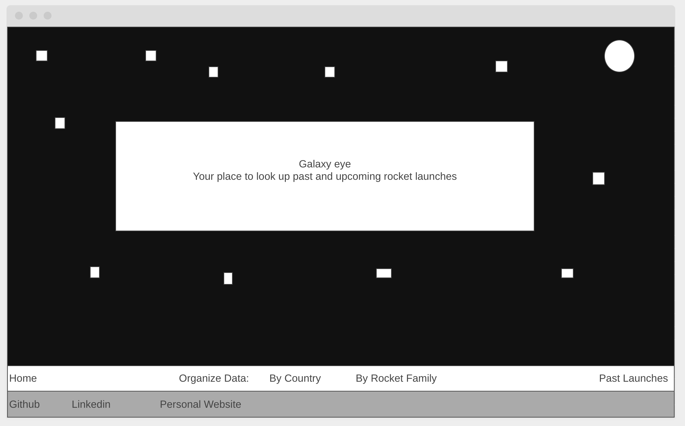
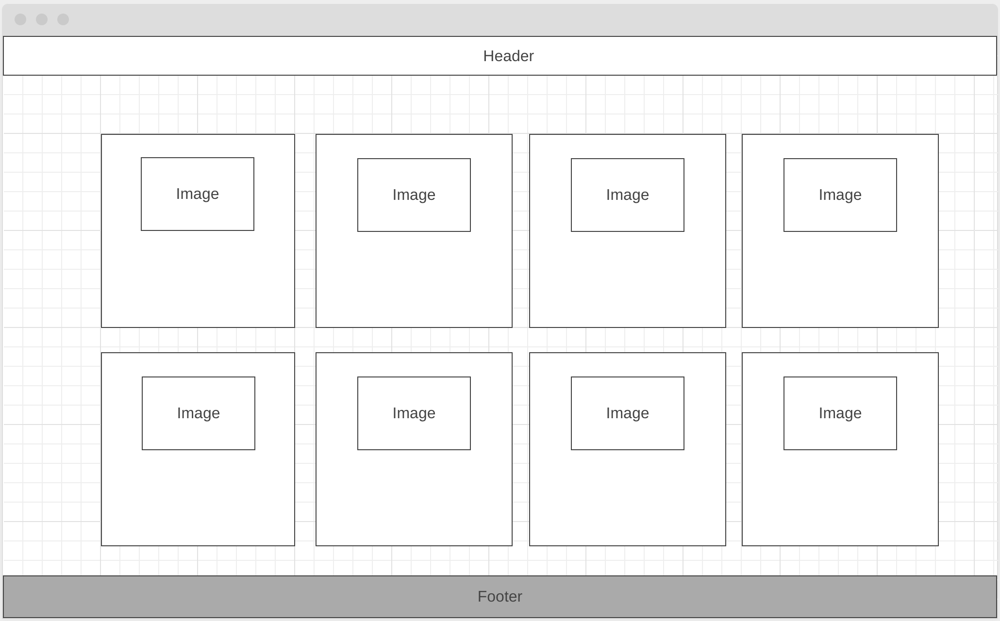
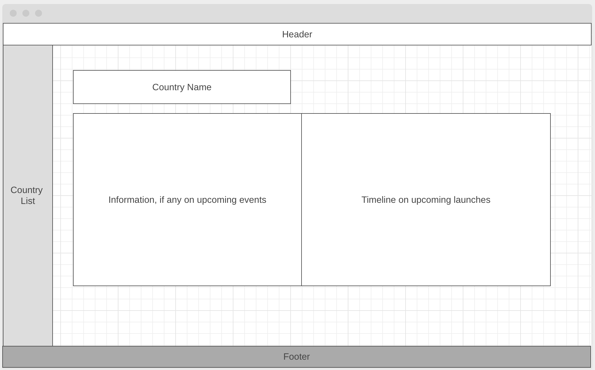
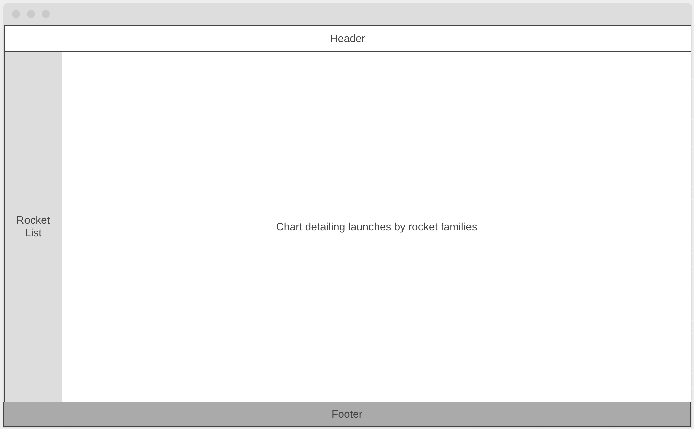

# GalaxyEye

## Overview
GalaxyEye is the data visualization tool to track upcoming rocket launches around the globe. The app provides real-time data on upcoming launches as well as graphing out launches by country and by rocket family.

# Wireframe

### Splash Page

The splash page will introduce the user to the website and also act as the first source of data. The splash page will be in a parallax style and the user will be able to scroll down (thereby pushing the header from the bottom to the top of the page as they scroll) in order to see a collection of cards detailing upcoming launches by date.

### By Country Page

This page will be comprised of a homepage which compares number of upcoming launches by each country and a left-hand menu to take a more detailed look in to a country's upcoming events.

### By Rocket Family

This page will organize upcoming launches by rocket family. Users will be able to pull up information on a specific rocket family by clicking on the appropriate name in the lefthand nav bar.

## Architecture
* Launch Library API - See https://launchlibrary.net/
* Javascript
* CSS/SCSS
* D3

