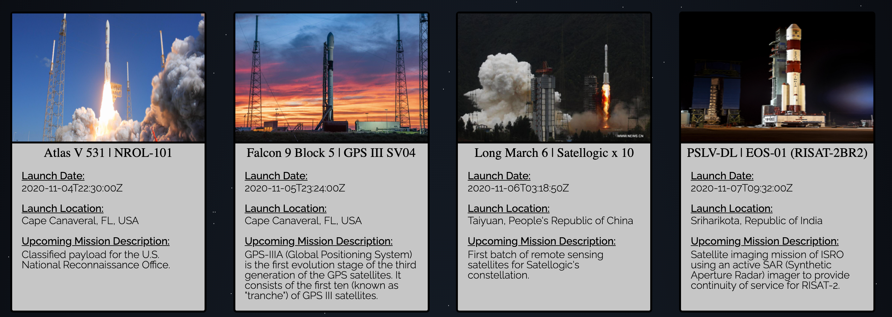
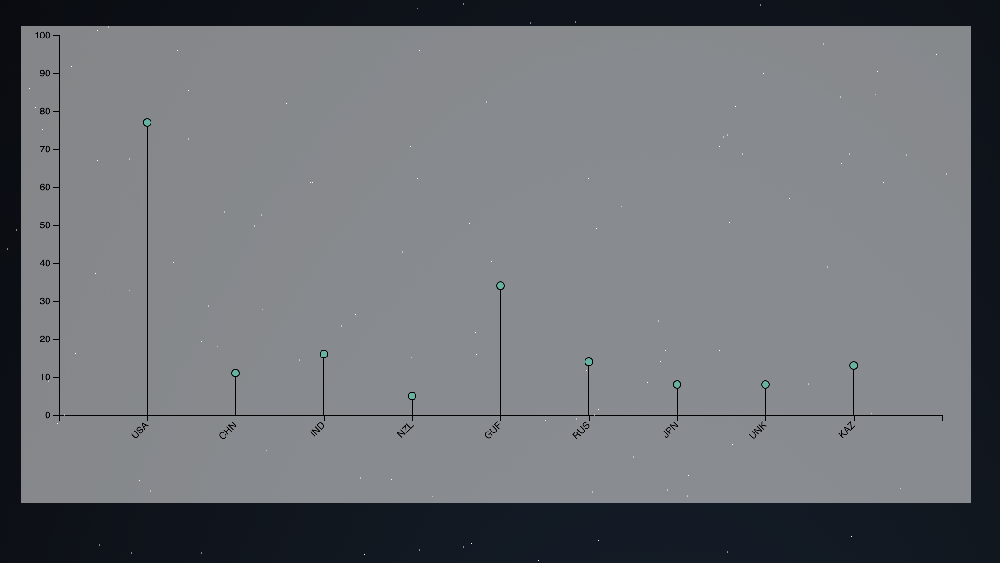
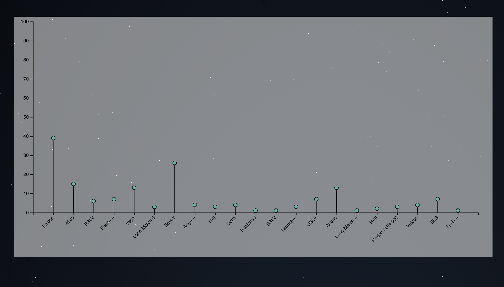

# GalaxyEye

GalaxyEye is the data visualization tool to track upcoming rocket launches around the globe. The app provides real-time data on upcoming launches as well as graphing out launches by country and by rocket family.

## Architecture
GalaxyEye was made with the following:
* Launch Library 2 API - See https://thespacedevs.com/llapi 
* Launch Library API - See https://launchlibrary.net/ (Note: Temporary until full switch to Launch Library 2)
* Javascript
* CSS/SCSS
* D3

 ## Rocket Information

By scrolling down on the opening page; you can review a collection of information on the twelve most recent launches. Information includes rocket name, launch timeline, location, and a description of the mission.

### Organize By Country

Clicking on this section of the application will lead you to a graph of how many launches are expected by launch location

### Organize By Rocket Family

This section of the application will outline how many launches are expected based on the model of rocket

